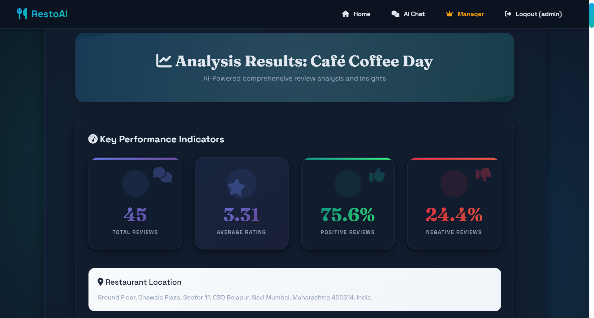
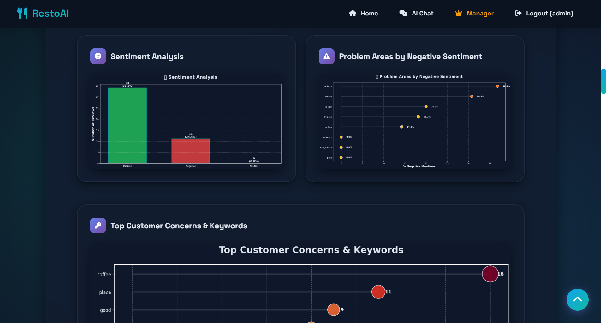
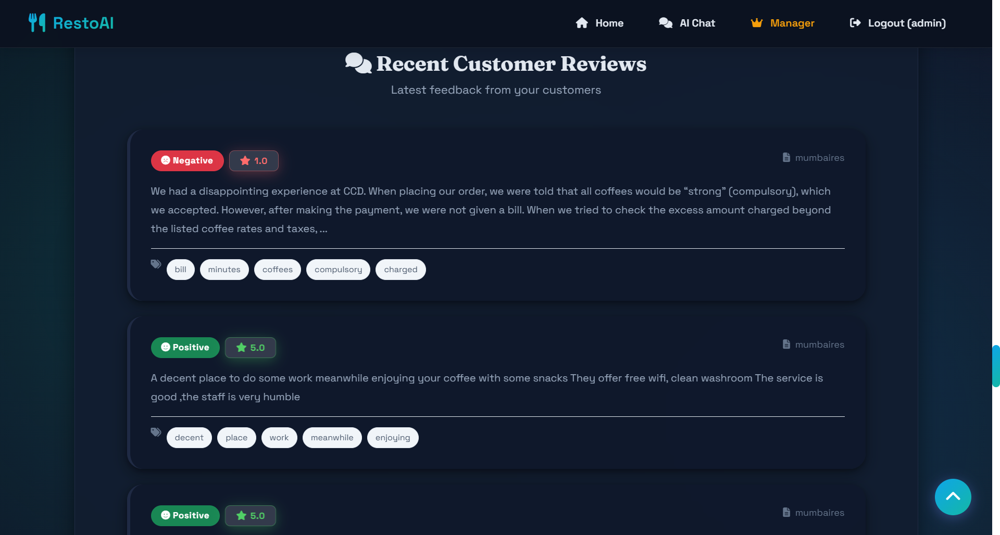
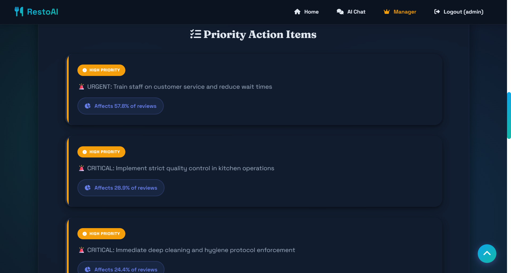
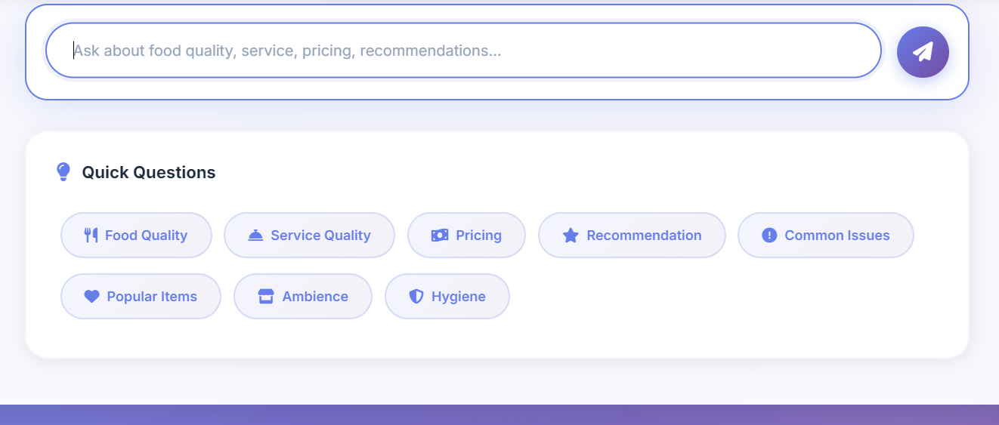

# 🍽️ Restaurant Review Analysis System

A comprehensive AI-powered restaurant review analysis platform with sentiment analysis, RAG-based chat, and intelligent visualizations.


## 📋 Table of Contents

- [Features](#features)
- [Screenshots](#screenshots)
- [System Architecture](#system-architecture)
- [Installation](#installation)
- [Project Structure](#project-structure)
- [Configuration](#configuration)
- [API Endpoints](#api-endpoints)
- [Technologies Used](#technologies-used)
- [Troubleshooting](#troubleshooting)
- [Performance](#performance)
- [Contributing](#contributing)
- [License](#license)
- [Authors](#authors)
- [Acknowledgments](#acknowledgments)
- [Contact](#contact)
- [Future Roadmap](#future-roadmap)

## ✨ Features

### 🎯 Core Features

- **Multi-Source Data Integration**: Loads reviews from 5+ CSV formats (Zomato, Mumbai Aires, Google Reviews)
- **AI-Powered Analysis**: 
  - Sentiment analysis (VADER)
  - Keyword extraction
  - Complaint categorization (8 categories)
  - Quality scoring (0-100)
- **RAG Chat System**: 
  - FAISS vector database for semantic search
  - Sentence-BERT embeddings (384 dimensions)
  - Context-aware responses
  - Intent detection (6 intents)
- **Advanced Visualizations**:
  - 9 different chart types
  - Sentiment distribution
  - Category heatmaps
  - Trend analysis
  - Rating distributions
- **Smart Recommendations**: AI-generated actionable insights with priority levels
- **Web Scraping Fallback**: Automatic web scraping when local data insufficient
- **Quality Control**: Intelligent deduplication and quality filtering

### 🚀 Advanced Features

- Persistent vector storage (FAISS indexes)
- Parallel web scraping (ThreadPoolExecutor)
- Restaurant-specific image generation
- Real-time chat with context
- Batch processing for multiple restaurants
- CSV export functionality
- Comprehensive statistics

## Screenshots

### Home Page


### Analysis Report




### Recommendation List


### AI Chat Assistant



## 🏗️ System Architecture

```
┌─────────────────┐
│   Flask App     │
│   (app.py)      │
└────────┬────────┘
         │
    ┌────┴────┐
    │         │
┌───▼───┐ ┌──▼────┐
│Analyzer│ │Scraper│
│ (NLP) │ │(Data) │
└───┬───┘ └──┬────┘
    │         │
    └────┬────┘
         │
    ┌────▼────┐
    │RAG Chat │
    │(FAISS)  │
    └─────────┘
```

### Data Flow

1. **Input**: Restaurant name → CSV datasets / Web scraping
2. **Processing**: Text cleaning → Sentiment analysis → Categorization
3. **Storage**: SQLite (reviews) + FAISS (vectors)
4. **Output**: Visualizations + Recommendations + Chat interface

## 🔧 Installation

### Prerequisites

- Python 3.8 or higher
- pip package manager
- 4GB+ RAM (for FAISS vector operations)
- Internet connection (for web scraping fallback)

### Step 1: Clone Repository

```bash
git clone https://github.com/yourusername/restaurant-review-analysis.git
cd restaurant-review-analysis
```

### Step 2: Create Virtual Environment

```bash
# Windows
python -m venv venv
venv\Scripts\activate

# Linux/Mac
python3 -m venv venv
source venv/bin/activate
```

### Step 3: Install Dependencies

```bash
pip install -r requirements.txt
```

### Step 4: Download NLTK Data

```bash
python -c "import nltk; nltk.download('stopwords'); nltk.download('punkt')"
```

### Step 5: Setup Directories

```bash
mkdir -p datasets uploads vector_db cache static/images
```

### Step 6: Add Dataset Files

Place your CSV files in the `datasets/` folder:
- `mumbaires.csv`
- `Resreviews.csv`
- `reviews.csv`
- `zomato.csv`
- `zomato2.csv`

### Step 7: Run Application

```bash
python app.py
```

Visit: `http://localhost:5000`

## 📁 Project Structure

```
Smart_Restaurant_System/
│
├── app.py                      # Main Flask application
├── analyzer.py                 # Sentiment analysis & visualizations
├── scraper.py                  # Data loading & web scraping
├── rag_chat.py                 # RAG chat with FAISS
│
├── requirements.txt            # Python dependencies
├── Readme.md                   # This file
├── LICENSE                     # License
│
├── datasets/                   # CSV data files
│   ├── import_csvs_to_mysql.py
│   ├── mumbaires.csv
│   ├── Resreviews.csv
│   ├── reviews.csv
│   ├── Yelpreviws.csv
│   ├── zomato.csv
│   └── zomato2.csv
│
├── images/                     # README screenshots
│
├── vector_db/                  # FAISS vector indexes
│   ├── Restaurant_Name.faiss
│   └── Restaurant_Name_metadata.pkl
│
├── instance/                   # Local runtime data
├── uploads/                    # User uploaded files
│
├── templates/                  # HTML templates
│   ├── base.html
│   ├── index.html
│   ├── results.html
│   ├── recommendations.html
│   └── chat.html
│
└── static/                     # Static assets
  └── style.css
```

## ⚙️ Configuration

### Environment Variables

Create a `.env` file (optional):

```bash
FLASK_ENV=development
FLASK_DEBUG=True
SECRET_KEY=your-secret-key-here
DATABASE_URI=sqlite:///reviews.db
MAX_CONTENT_LENGTH=16777216  # 16MB
```

### Application Settings (app.py)

```python
UPLOAD_FOLDER = "uploads"
DATASET_FOLDER = "datasets"
ALLOWED_EXT = {"csv", "txt"}

# Vector DB settings
EMBEDDING_MODEL = "all-MiniLM-L6-v2"  # 384 dimensions
VECTOR_DB_FOLDER = "vector_db"
```

### Quality Thresholds (scraper.py)

```python
MIN_REVIEW_LENGTH = 30
MAX_REVIEW_LENGTH = 2000
MIN_WORD_COUNT = 5
QUALITY_THRESHOLD = 50  # 0-100 scale
```


## 🌐 API Endpoints

### GET /

**Description**: Home page with restaurant list

**Response**: HTML page

---

### POST /analyze

**Description**: Analyze restaurant reviews

**Parameters:**
- `restaurant_name` (string, required)
- `datafile` (file, optional)
- `try_scrape` (boolean, optional)

**Response**: Redirect to results page

---

### GET /results

**Description**: View analysis results

**Parameters:**
- `restaurant_name` (string, required)

**Response**: HTML with visualizations

---

### GET /recommendations

**Description**: Get AI recommendations

**Parameters:**
- `restaurant_name` (string, required)

**Response**: HTML with recommendations

---

### POST /chat

**Description**: Chat with reviews using RAG

**Request Body:**
```json
{
  "question": "How is the food?"
}
```

**Response:**
```json
{
  "answer": "Based on reviews...",
  "sources": ["review1", "review2"]
}
```

---

### GET /search_restaurants

**Description**: Search restaurants by name

**Parameters:**
- `q` (string, required)

**Response:**
```json
[
  {
    "name": "Restaurant Name",
    "rating": 4.5,
    "address": "Location"
  }
]
```

## 🛠️ Technologies Used

### Backend

- **Flask 3.0+**: Web framework
- **SQLAlchemy**: ORM for database
- **FAISS**: Vector similarity search
- **Sentence-Transformers**: Text embeddings
- **VADER Sentiment**: Sentiment analysis
- **BeautifulSoup4**: Web scraping
- **Pandas**: Data processing
- **NumPy**: Numerical operations

### NLP & AI

- **NLTK**: Natural language toolkit
- **scikit-learn**: Machine learning
- **SentenceTransformers**: all-MiniLM-L6-v2 model
- **VADER**: Sentiment intensity analyzer

### Visualization

- **Matplotlib**: Chart generation
- **Seaborn**: Statistical visualizations
- **Plotly** (optional): Interactive charts

### Frontend

- **HTML5/CSS3**: Templates
- **JavaScript**: Interactive features
- **Bootstrap** (optional): UI framework

## 🐛 Troubleshooting

### Issue: FAISS not installing

**Solution:**
```bash
# Use CPU version
pip install faiss-cpu

# Or GPU version (requires CUDA)
pip install faiss-gpu
```

---

### Issue: "No module named 'sentence_transformers'"

**Solution:**
```bash
pip install sentence-transformers
```

---

### Issue: SQLite database locked

**Solution:**
```bash
# Delete database and restart
rm reviews.db
python app.py
```

---

### Issue: Out of memory (FAISS)

**Solution:**
- Reduce `max_reviews` parameter
- Use smaller embedding model
- Process restaurants in batches

---

### Issue: Web scraping not working

**Solution:**
- Check internet connection
- Verify `enable_web_scraping=True`
- Sites may block scrapers (expected)
- Use local datasets instead

---

### Issue: Visualizations not showing

**Solution:**
```bash
# Check matplotlib backend
python -c "import matplotlib; print(matplotlib.get_backend())"

# Should be 'Agg' for Flask
```

---

### Issue: Reviews not found

**Solution:**
1. Check dataset files exist in `datasets/` folder
2. Verify restaurant name spelling
3. Check CSV column names match expected format
4. Enable debug mode: `FLASK_DEBUG=True`

## 📊 Performance

### Benchmarks (Intel i5, 8GB RAM)

| Operation | Time | Notes |
|-----------|------|-------|
| Load 100 reviews | ~500ms | From CSV |
| Create FAISS index | ~2s | 100 reviews |
| Semantic search | ~50ms | Per query |
| Generate visualizations | ~3s | 9 charts |
| Web scraping | ~30s | 20 reviews |

### Optimization Tips

1. **Use FAISS cache**: Vectors saved to disk after first analysis
2. **Batch processing**: Process multiple restaurants at once
3. **Quality filtering**: Set `quality_threshold=60` to filter low-quality reviews
4. **Limit reviews**: Use `max_reviews=50` for faster processing
5. **Parallel scraping**: Enabled by default (4 threads)

## 🤝 Contributing

Contributions are welcome! Please follow these steps:

1. Fork the repository
2. Create a feature branch (`git checkout -b feature/AmazingFeature`)
3. Commit changes (`git commit -m 'Add AmazingFeature'`)
4. Push to branch (`git push origin feature/AmazingFeature`)
5. Open a Pull Request

### Code Style

- Follow PEP 8 guidelines
- Add docstrings to functions
- Include type hints where possible
- Write unit tests for new features

## 📝 License

This project is licensed under the MIT License - see the [LICENSE](LICENSE) file for details.

## 👥 Authors

- **Your Name** - *Initial work* - [YourGitHub](https://github.com/yourusername)

## 🙏 Acknowledgments

- VADER Sentiment Analysis
- Facebook AI Research (FAISS)
- Sentence-BERT team
- Open-source community

## 📧 Contact

- **Email**: your.email@example.com
- **GitHub**: [@yourusername](https://github.com/yourusername)
- **LinkedIn**: [Your Name](https://linkedin.com/in/yourprofile)

## 🔮 Future Roadmap

- [ ] Multi-language support
- [ ] Real-time review monitoring
- [ ] Mobile app
- [ ] Advanced NLP with GPT models
- [ ] Restaurant comparison tool
- [ ] Social media integration
- [ ] Email report generation
- [ ] REST API with authentication
- [ ] Docker containerization
- [ ] Cloud deployment (AWS/GCP)

---
